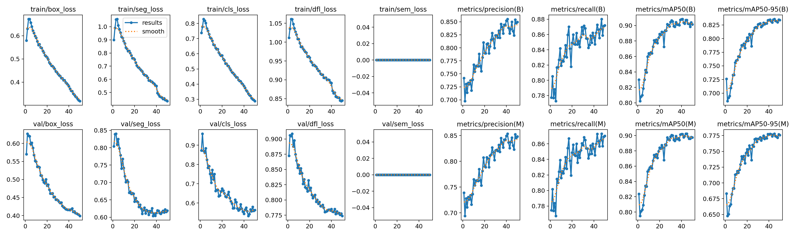
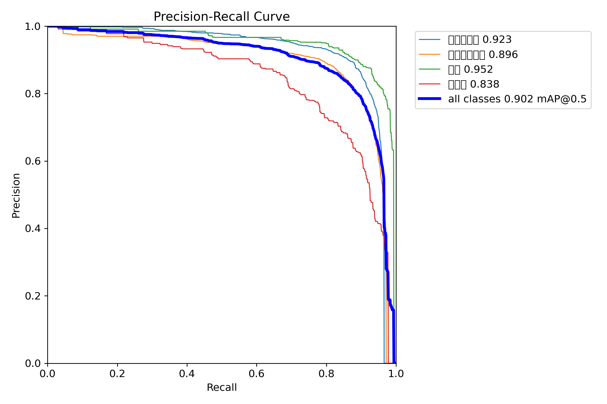
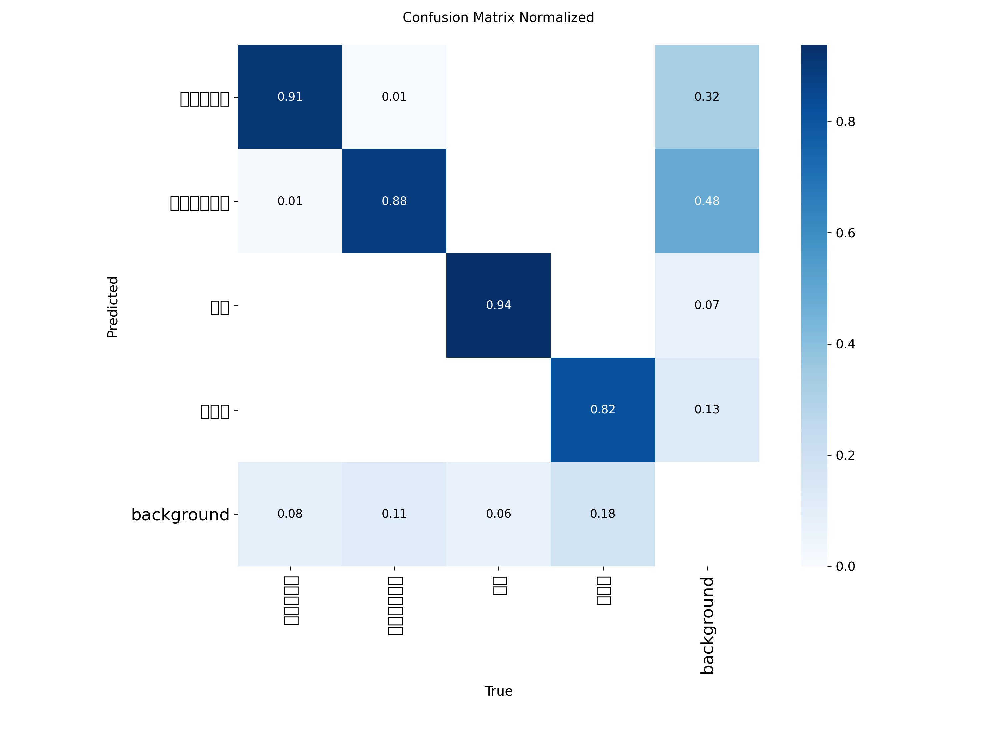

# 无人机视觉数据处理流水线

[English README](README.md)

这是一个可配置的无人机视频数据处理与道路分割模型评估原型。

项目来源于实习期间的实际工作流程。公开仓库只包含代码、评估总结和不涉及敏感信息的结果图，不包含公司内部无人机数据和模型权重。

## 处理流程

```text
无人机视频
    ↓
视频收集与重命名
    ↓
视频抽帧
    ↓
图片汇总与可追溯重命名
    ↓
基于 CNN 特征和 FAISS 的相似图片去重
    ↓
图片完整性检查
    ↓
生成流水线统计报告
```

## 主要功能

- 递归扫描多层目录中的视频。
- 生成稳定文件名，避免重名覆盖。
- 使用多进程进行视频抽帧。
- 通过完成标记支持中断后重复运行。
- 将图片汇总到统一目录，并保存来源映射。
- 使用 CNN 特征和 FAISS 相似度搜索进行图片去重。
- 缓存图片特征，减少不必要的重复计算。
- 检查空文件和无法读取的图片。
- 自动生成数据处理统计报告。
- 通过统一配置文件管理路径和处理参数。

## 项目结构

```text
.
├── run_pipeline.py
├── vedioCopy_v2.py
├── vedio_cut_v2.py
├── pic_gather_v2.py
├── SimilarPic_v2.py
├── check_images.py
├── generate_report.py
├── config.example.py
└── model_result/
    ├── English_evaluation.md
    ├── Chinese_evaluation.md
    ├── error_analysis.csv
    ├── results.csv
    ├── results.png
    ├── MaskPR_curve.png
    └── confusion_matrix_normalized.png
```

## 配置

复制配置示例：

```powershell
Copy-Item config.example.py config.py
```

然后在 `config.py` 中修改输入路径和处理参数。

主要参数包括：

- `INPUT_PATH`
- `FRAME_INTERVAL`
- `MAX_COPY_WORKERS`
- `MAX_CUT_PROCESSES`
- `MIN_SIMILARITY_THRESHOLD`
- `BATCH_SIZE`
- `MAX_THREADS`
- `USE_GPU`

本地 `config.py` 不上传 Git，因为其中可能包含电脑上的真实路径。

## 运行流水线

```powershell
python run_pipeline.py
```

主程序会按顺序执行各处理阶段，某一步失败时停止并显示错误。

也可以单独运行每个模块：

```powershell
python vedioCopy_v2.py
python vedio_cut_v2.py
python pic_gather_v2.py
python SimilarPic_v2.py
python check_images.py
python generate_report.py
```

## 道路分割模型评估

项目对一个包含四类道路相关目标的 YOLO 分割模型进行了评估。

主要验证结果：

- Mask mAP@0.5：约 **0.902**
- Mask mAP@0.5:0.95：约 **0.778**







人工样本分析发现：

- 轮廓清晰、面积中等或较大的道路区域整体分割效果较好。
- 主要模型错误是远距离和小面积区域漏检。
- 原始数据中的类别曾被分配到不同标注任务，因此少量参考标签不完整。
- 在部分人工检查案例中，即使参考标签没有包含全部目标，模型预测仍与图片中的可见区域一致。

详细材料位于：

- [`model_result/English_evaluation.md`](model_result/English_evaluation.md)
- [`model_result/Chinese_evaluation.md`](model_result/Chinese_evaluation.md)
- [`model_result/error_analysis.csv`](model_result/error_analysis.csv)

## 项目限制

- 当前项目是工程原型，不是正式生产部署系统。
- 公开仓库不包含公司内部图片、完整数据集和模型权重。
- 部分标注不完整，可能影响验证指标的解释。
- 远距离和小目标区域仍然是当前模型的主要弱点。
- 当图片集合发生变化时，现有特征缓存需要重新生成。

## 隐私说明

公开版本不包含公司数据、客户信息、内部服务器地址、账号凭据或专有模型权重。
