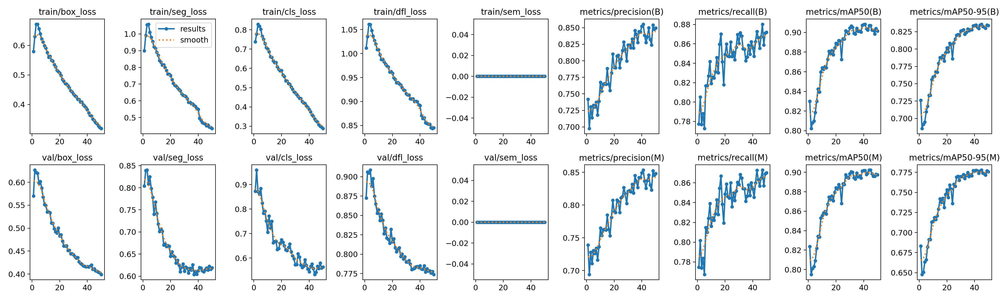
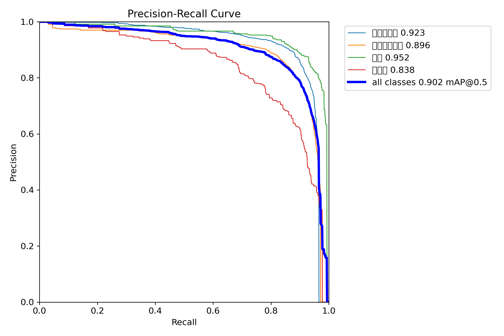
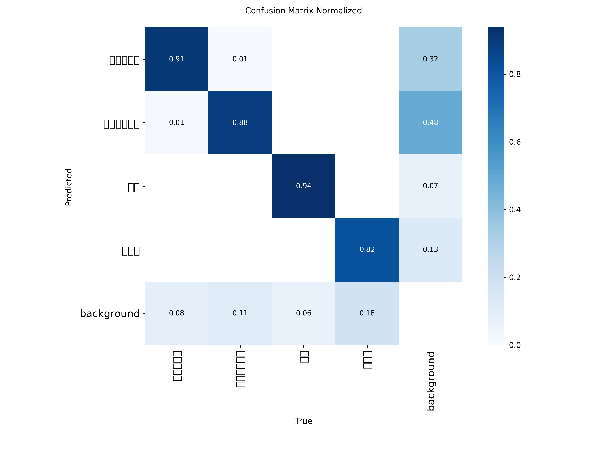

# 无人机视觉数据处理流水线

[English README](README.md)

这是一个可配置的无人机视频数据处理与道路分割模型评估原型。

项目来源于实习期间的实际工作流程。公开仓库只包含代码、评估总结和不涉及敏感信息的结果图，不包含公司内部无人机数据和模型权重。

## 处理流程

```text
无人机视频
    ↓
视频收集与重命名
    ↓
视频抽帧
    ↓
图片汇总与可追溯重命名
    ↓
基于 CNN 特征和 FAISS 的相似图片去重
    ↓
图片完整性检查
    ↓
生成流水线统计报告
```

## 主要功能

- 递归扫描多层目录中的视频。
- 生成稳定文件名，避免重名覆盖。
- 使用多进程进行视频抽帧。
- 通过完成标记支持中断后重复运行。
- 将图片汇总到统一目录，并保存来源映射。
- 使用 CNN 特征和 FAISS 相似度搜索进行图片去重。
- 缓存图片特征，减少不必要的重复计算。
- 检查空文件和无法读取的图片。
- 自动生成数据处理统计报告。
- 通过统一配置文件管理路径和处理参数。

## 项目结构

```text
.
├── run_pipeline.py
├── video_copy.py
├── frame_extraction.py
├── image_gather.py
├── image_deduplication.py
├── check_images.py
├── generate_report.py
├── config.example.py
├── pipeline_config.py
├── pipeline_utils.py
├── requirements.txt
├── constraints-windows-py312.txt
├── tests/
└── model_result/
    ├── English_evaluation.md
    ├── Chinese_evaluation.md
    ├── error_analysis.csv
    ├── results.csv
    ├── results.png
    ├── MaskPR_curve.png
    └── confusion_matrix_normalized.png
```

## 安装

已验证的基准环境为 **Windows x64、Python 3.12、CPU 版 PyTorch**。其他操作系统、Python 和 CUDA 组合尚未验证。请先创建并激活虚拟环境，再安装依赖。

1. 克隆仓库：

```bash
git clone https://github.com/wwszsmm/uav_data_pipeline.git
cd uav_data_pipeline
```

2. 安装项目依赖：

```bash
python -m pip install -r requirements.txt -c constraints-windows-py312.txt
```

3. 根据示例创建本地配置文件：

```bash
cp config.example.py config.py
```

根据本地环境修改 `config.py` 中的数据路径和相关参数。

4. 运行完整数据处理流水线：

```bash
python run_pipeline.py
```

如有需要，也可以单独运行各个处理模块。

## 配置

复制配置示例：

```powershell
Copy-Item config.example.py config.py
```

然后在 `config.py` 中修改输入路径和处理参数。

主要参数包括：

- `INPUT_PATH`
- `FRAME_INTERVAL`
- `MAX_COPY_WORKERS`
- `MAX_CUT_PROCESSES`
- `MIN_SIMILARITY_THRESHOLD`
- `BATCH_SIZE`
- `MAX_THREADS`
- `USE_GPU`

本地 `config.py` 不上传 Git，因为其中可能包含电脑上的真实路径。

## 运行流水线

```powershell
python run_pipeline.py
```

主程序会按顺序执行各处理阶段，某一步失败时停止并显示错误。

也可以单独运行每个模块：

```powershell
python video_copy.py
python frame_extraction.py
python image_gather.py
python image_deduplication.py
python check_images.py
python generate_report.py
```

## 运行与恢复规则

- 配置中的相对路径以配置文件所在目录为基准。默认读取 `config.py`；也可将环境变量 `UAV_CONFIG` 设置为另一个配置文件的绝对路径。
- 输入根目录与输出根目录必须相互独立，不能嵌套；各阶段输出目录必须是 `OUTPUT_ROOT` 内不重叠的目录。同一输出根目录一次只运行一个流程，运行期间不要修改输入和配置。
- **旧版迁移：** 请在配置文件中选择新的空 `OUTPUT_ROOT`。旧版非空阶段目录没有归属清单时会被拒绝使用，原数据不会被清理。不要删除清单来强制复用旧目录。
- 复制采用临时文件加原子替换，并比较 SHA-256。各阶段记录当前有效文件；源内容更新或文件移除会反映到当前输出。只清理本阶段曾记录且未被外部修改的过期文件，不删除无关文件。
- 抽帧快照关联视频内容、抽帧间隔及解码配置；只有记录中的图片完整时才复用。旧快照保留在磁盘中，但汇总和报告只读取当前清单，因此修改输入或参数后磁盘占用可能增加。
- 写入失败、空输入以及可检测到的解码不完整会阻止后续处理。OpenCV 不一定提供可靠的总帧数，因此不能保证检测所有损坏视频。
- 特征缓存记录图片内容摘要、模型标识和软件版本；内容变化或缓存损坏时重建。预处理采用模型自身的变换；相似度阈值仍需用有代表性的无人机图片验证。
- 无法读取的图片不会进入去重输出，文件名列在 `deduped_images/rejected_images.json`。最终图片完整性检查必须通过。`pipeline_status.json` 与 `pipeline_report.md` 区分失败、完成、排除异常图片后完成；重复率以有效输入图片为分母。
- 单独运行模块时需要前置阶段生成的有效清单。修改输入后应重跑完整流水线；单独生成报告不能认证一次新运行，配置或数据变化后会标注未验证。
- `USE_GPU` 仅控制视频解码；标准 `opencv-python` 在 CUDA 解码不可用时回退到 CPU。CNN 是否使用 CUDA 由安装的 PyTorch 独立判断。
- 首次 CNN 缓存未命中时可能下载约 10 MB 的公开 MobileNet ImageNet 权重。离线运行前可执行 `python -c "from imagededup.methods.cnn import CNN; CNN()"` 准备缓存，保留 PyTorch 缓存目录或通过 `TORCH_HOME` 指定路径。预处理无需私有分割模型权重；六个阶段不使用 `ultralytics`，运行流水线不会重新生成历史分割评估结果。

### 验证方法

在同一虚拟环境中安装测试依赖：

```bash
python -m pip install -r requirements-dev.txt -c constraints-windows-py312.txt
python -m pip check
python -m pytest -q
```

默认测试不下载模型，并跳过完整模型测试。准备好模型缓存后，可在 PowerShell 中运行真实 CPU 集成测试：

```powershell
$env:UAV_RUN_MODEL_TEST = "1"
python -m pytest -q
```

集成测试临时生成合成视频，检查六个阶段、缓存复用、同名视频替换、输入增删及过期报告识别，不验证私有无人机数据质量、GPU 执行或历史 YOLO 指标。

## 道路分割模型评估

项目对一个包含四类道路相关目标的 YOLO 分割模型进行了评估。

主要验证结果：

- Mask mAP@0.5：约 **0.902**
- Mask mAP@0.5:0.95：约 **0.778**







人工样本分析发现：

- 轮廓清晰、面积中等或较大的道路区域整体分割效果较好。
- 主要模型错误是远距离和小面积区域漏检。
- 原始数据中的类别曾被分配到不同标注任务，因此少量参考标签不完整。
- 在部分人工检查案例中，即使参考标签没有包含全部目标，模型预测仍与图片中的可见区域一致。

详细材料位于：

- [`model_result/English_evaluation.md`](model_result/English_evaluation.md)
- [`model_result/Chinese_evaluation.md`](model_result/Chinese_evaluation.md)
- [`model_result/error_analysis.csv`](model_result/error_analysis.csv)

## 项目限制

- 当前项目是工程原型，不是正式生产部署系统。
- 公开仓库不包含公司内部图片、完整数据集和模型权重。
- 部分标注不完整，可能影响验证指标的解释。
- 远距离和小目标区域仍然是当前模型的主要弱点。
- 图片内容或缓存记录的模型环境变化时，特征缓存自动重建。

## 隐私说明

公开版本不包含公司数据、客户信息、内部服务器地址、账号凭据或专有模型权重。
